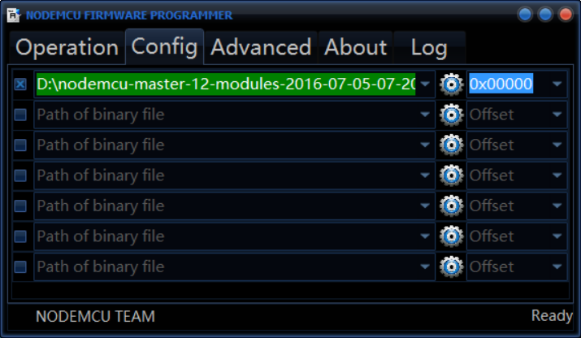
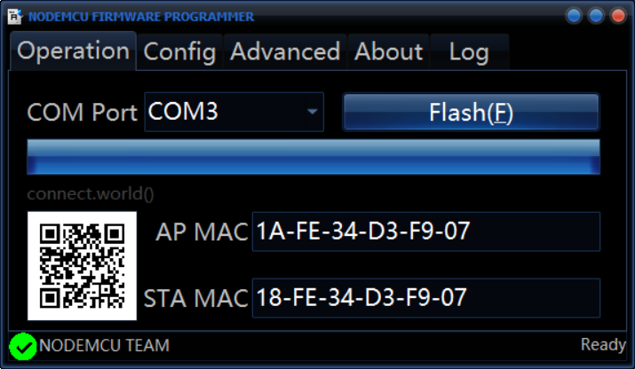
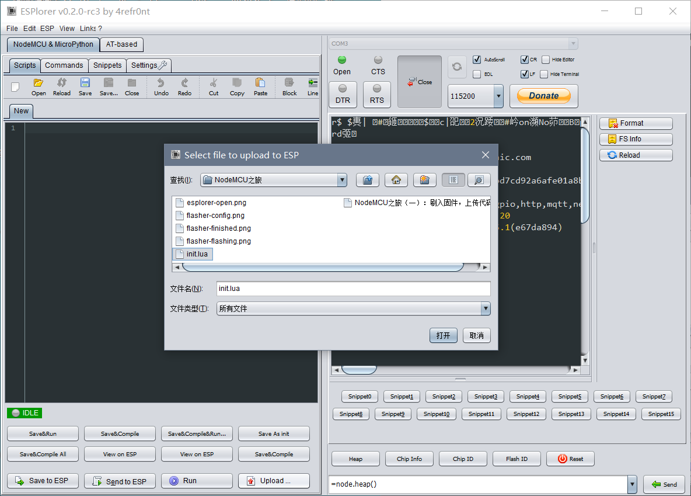
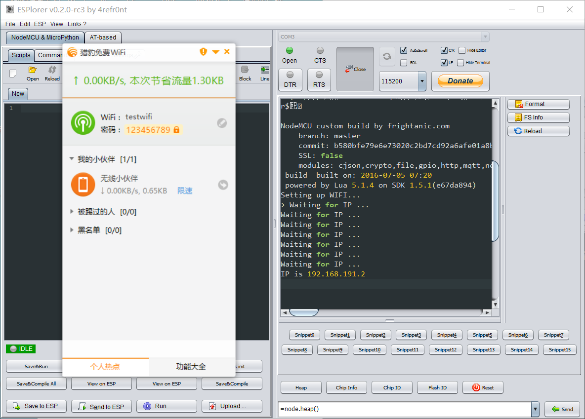

# NodeMCU之旅（一）：构建、刷入固件，上传代码

## 扬帆起航

本系列文章将试图实现，使用Web页面远程点亮led。具体包括：

* 在NodeMCU上搭建HTTP服务器，使其可以通过Web页面配置要接入的网络。


* 在配置页面可以显示附近中英网络名与信号强度。


* 使用MQTT协议与Node.js服务端的通信。


## 构建固件

[Building the firmware](http://nodemcu.readthedocs.io/en/master/en/build/)提供了三种构建你自己固件的方式。

这里推荐使用简单的云构建服务[NodeMCU custom builds](http://nodemcu-build.com/)来定制自己的固件，只需要在该网站选择你需要的库，留下邮箱，不一会就能收到编译好的固件。

我选择了这些库：cjson,crypto,file,gpio,http,mqtt,net,node,pwm,tmr,uart,wifi


## 刷入固件

下载[nodemcu-flasher](https://github.com/nodemcu/nodemcu-flasher)的**Release**版本，注意操作系统位数。

连接NodeMCU到电脑，运行**flasher**。

在**Config**选项卡下，配置好自己固件的路径。



然后回到**Operation**下，点击**Flash(F)**，稍等片刻即可。





## 上传代码

[Uploading code](http://nodemcu.readthedocs.io/en/master/en/upload/)同样提供了多种工具来上传代码与文件到NodeMCU。

推荐使用**ESPlorer**，需要**Java环境**。下载[ESPlorer.zip](http://esp8266.ru/esplorer/#download)。

解压后，运行**ESPlorer.jar**。

在ESPlorer窗口右上部，设置端口号。

点击**Open**，按下NodeMCU上的**RST**按钮重启。如果一切正常，会有这些输出：


NodeMCU会在启动后立即运行**init.lua**，但是现在我们还没有上传这个文件。

用你喜爱的编辑器保存下面代码为**init.lua**。这些代码会使NodeMCU连接到一个AP(Access Point)，通过修改第四行代码来配置SSID和密码。对于开放网络，使用空文本作为密码。

``` lua
-- init.lua
print('Setting up WIFI...')
wifi.setmode(wifi.STATION)
wifi.sta.config('MY_SSID', 'MY_PASSWORD')
wifi.sta.connect()

tmr.alarm(1, 1000, tmr.ALARM_AUTO, function()
    if wifi.sta.getip() == nil then
        print('Waiting for IP ...')
    else
        print('IP is ' .. wifi.sta.getip())
    tmr.stop(1)
    end
end)
```

保存后，点击ESPlorer窗口左下区域的**Upload ...**来上传。如果上传失败，尝试重启NodeMCU再试。



上传完毕后重启NodeMCU。如果一切正常，你将看到NodeMCU成功连入你的AP。




## 资源

[NodeMCU文档](http://nodemcu.readthedocs.io/)

[NodeMCU custom builds](http://nodemcu-build.com/)

[nodemcu-flasher](https://github.com/nodemcu/nodemcu-flasher)

[ESPlorer.zip](http://esp8266.ru/esplorer/#download)
